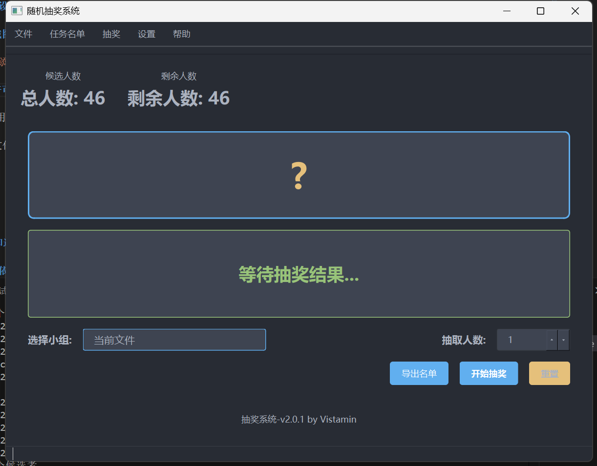

<div align="center">

# 🎲 随机抽奖系统 V2.1.0


*一个现代化的随机抽奖应用程序，基于 PySide6 和 PyOneDark 主题*


</div>

## 📝 功能概述

这是一个功能全面的随机抽奖系统，专为各类抽奖活动设计，包括课堂点名、活动抽奖等多种场景。

## ✨ 功能特点

- **多种抽奖模式** 
  - 🎯 **等概率抽奖**: 每个候选者有相同的概率被抽中
  - ⚖️ **权重抽奖**: 根据设定的权重值决定被抽中的概率
  - 🔄 **可重复抽取**: 可选择是否允许重复抽取已选中的候选者

- **多样化数据源** 
  - 📂 **本地文件导入**: 支持从本地文件导入候选者名单
  - 🌐 **远程URL导入**: 支持从远程URL获取候选者名单
  - 📊 **多种文件格式**: 支持CSV、TXT、Excel、JSON等多种格式

- **用户体验增强** 
  - ✅ **动画效果**: 流畅的滚动和过渡动画增强视觉体验
  - 🔊 **音效反馈**: 抽奖过程中的音效提示
  - 🌓 **暗色/亮色主题**: 支持切换界面主题模式
  - 🎨 **自定义主题颜色**: 可自定义界面主要颜色

- **高级功能** 
  - 🔐 **密码保护**: 可为设置界面设置密码保护
  - 🔒 **任务加密**: 支持对敏感任务数据进行加密存储
  - ⚙️ **自定义参数**: 支持添加自定义参数扩展功能
  - 👥 **智能小组管理**: 支持创建和管理多个候选者组，自动记住选择历史
  - ✏️ **任务编辑**: 支持直接编辑已保存的任务名单
  - 📂 **日志分类管理**: 按日期自动分类存储日志文件
  - 🔒 **离线运行**: 支持在无网络环境下完全正常运行

## 📄 文件格式支持

应用程序支持以下文件格式：

| 格式 | 说明 |
|------|------|
| **CSV** | 第一列为名字，第二列为权重（可选） |
| **TXT** | 每行一个名字，可以用空格、逗号或制表符分隔名字和权重 |
| **Excel** | 第一列为名字，第二列为权重（可选） |
| **JSON** | 支持列表格式 `["名字1", "名字2"]` 或字典格式 `{"名字1": 权重1, "名字2": 权重2}` |

## 🚀 快速开始

1. 确保安装了Python 3.10或更高版本
2. 安装依赖: `pip install -r requirements.txt`
3. 启动应用: `python start.py`

## 🛠️ 设置选项

应用程序提供多种设置选项，可通过点击主界面上的设置按钮访问：

- **文件设置**: 管理本地和远程数据源
- **抽奖设置**: 配置抽奖模式、数量和行为
- **界面设置**: 自定义主题和颜色
- **自定义参数**: 添加扩展参数
- **安全设置**: 配置密码保护

## 📱 截图

<div align="center">

<p><i>随机抽奖系统 V2.0 界面预览</i></p>
</div>

## 安装和运行

### 安装依赖

```bash
pip install -r requirements.txt
```

### 运行程序

```bash
python start.py
```

## 使用说明

1. **添加名单文件**:
   - 点击"设置"按钮，在"文件设置"选项卡中添加本地文件或远程URL
   - 或者点击主界面的"加载文件"按钮直接选择文件

2. **配置抽奖参数**:
   - 在"抽奖设置"选项卡中选择抽奖模式（等概率或权重模式）
   - 设置抽取人数和是否允许重复抽取

3. **开始抽奖**:
   - 在主界面选择要使用的名单文件
   - 设置抽取人数
   - 点击"开始抽奖"按钮

4. **自定义参数**:
   - 在"自定义参数"选项卡中添加自定义参数和值

## 项目结构

```
random-v2.0/
├── src/                  # 源代码目录
│   ├── main.py           # 主程序入口
│   ├── config/           # 配置文件
│   │   ├── constants.py  # 常量定义
│   │   └── settings.py   # 应用设置
│   ├── ui/               # UI相关
│   │   ├── styles/       # 样式表
│   │   ├── widgets/      # 自定义控件
│   │   ├── main_window.py # 主窗口
│   │   └── settings_dialog.py # 设置对话框
│   └── utils/            # 工具函数
│       ├── animation.py  # 动画效果
│       ├── data_parser.py # 数据解析
│       ├── lottery_engine.py # 抽奖引擎
│       └── validator.py  # 输入验证
├── requirements.txt      # 项目依赖
├── start.py              # 启动脚本
└── README.md             # 项目说明
```

## 💻 开发环境

| 依赖项 | 版本要求 |
|-------|---------|
| Python | ≥ 3.10 |
| PySide6 | ≥ 6.5.0 |
| pandas | ≥ 2.0.0 |
| requests | ≥ 2.28.0 |
| openpyxl | ≥ 3.1.0 |

完整依赖列表请参见 [requirements.txt](requirements.txt)

## 📋 更新日志

查看详细的版本更新记录，请参考 [CHANGELOG.md](CHANGELOG.md)

## 📋 数据格式示例

### CSV 示例

```csv
姓名,权重
张三,10
李四,5
王五,7
```

### JSON 示例

```json
{
  "张三": 10,
  "李四": 5,
  "王五": 7
}
```

```json
["张三", "李四", "王五"]
```


### 其他建议添加的部分

```markdown
## 🔧 常见问题解答

1. **Q: 如何启用密码保护功能？**  
   A: 在设置界面中，切换到"安全设置"选项卡，勾选"启用密码保护"并设置您的密码。

2. **Q: 是否支持分组抽奖？**  
   A: 支持。您可以在设置界面中创建多个候选者组，并在主界面选择使用哪个组进行抽奖。

3. **Q: 如何自定义界面颜色？**  
   A: 在设置界面的"界面设置"选项卡中，您可以点击各个颜色方块来自定义界面主题颜色。

## 🌟 GitHub 仓库

项目托管在 GitHub 上，欢迎访问、Star 和贡献：

**🔗 [https://github.com/vistaminc/randompeople](https://github.com/vistaminc/randompeople)**

## 🤝 贡献指南

欢迎贡献代码、提交问题报告或功能建议。请遵循以下步骤：

1. Fork 本仓库
2. 创建您的功能分支 (`git checkout -b feature/amazing-feature`)
3. 提交您的更改 (`git commit -m 'Add some amazing feature'`)
4. 推送到分支 (`git push origin feature/amazing-feature`)
5. 打开一个 Pull Request

## 📦 应用程序打包指南

要将应用程序打包为独立的可执行文件，请按照以下步骤使用PyInstaller：

### 安装PyInstaller

```bash
pip install pyinstaller
```

### 创建spec文件

```bash
pyi-makespec --name "RandomPeople" --windowed --icon=src/assets/icons/app.ico src/main.py
```

### 修改spec文件

打开生成的`RandomPeople.spec`文件，修改内容如下：

```python
# -*- mode: python ; coding: utf-8 -*-

block_cipher = None

# 添加所有需要包含的资源文件
added_files = [
    ('src/assets/icons/*', 'src/assets/icons'),
    ('src/ui/styles/*', 'src/ui/styles'),  # 包含样式表文件
    ('src/config/*.py', 'src/config'),  # 包含配置模块
    ('picture/*.png', 'picture'),  # 包含图片资源
]

a = Analysis(
    ['start.py'],  # 使用start.py作为入口点
    pathex=[],
    binaries=[],
    datas=added_files,
    hiddenimports=[
        # 核心Qt模块
        'PySide6.QtCore', 
        'PySide6.QtGui', 
        'PySide6.QtWidgets',
        'PySide6.QtSvg',  # 支持SVG图标
        
        # 数据处理模块
        'pandas',  # 处理表格数据
        'openpyxl',  # Excel支持
        'json',  # JSON文件支持
        
        # 项目自有模块
        'src.config.settings',
        'src.ui.main_window',
        'src.ui.settings_dialog',
    ],
    hookspath=[],
    hooksconfig={},
    runtime_hooks=[],
    excludes=[],
    win_no_prefer_redirects=False,
    win_private_assemblies=False,
    cipher=block_cipher,
    noarchive=False,
)

pyz = PYZ(
    a.pure, 
    a.zipped_data,
    cipher=block_cipher
)

exe = EXE(
    pyz,
    a.scripts,
    [],
    exclude_binaries=True,
    name='RandomPeople',
    debug=False,
    bootloader_ignore_signals=False,
    strip=False,
    upx=True,
    console=False,  # 设置为False以隐藏控制台窗口
    icon='src/icon.png',  # 使用PNG图标文件
    disable_windowed_traceback=False,
    argv_emulation=False,
    target_arch=None,
    codesign_identity=None,
    entitlements_file=None,
)

coll = COLLECT(
    exe,
    a.binaries,
    a.zipfiles,
    a.datas,
    strip=False,
    upx=True,
    upx_exclude=[],
    name='RandomPeople',
)
```

### 执行打包

```bash
pyinstaller RandomPeople.spec
```

### 特别注意事项

1. **资源文件处理**：确保所有资源文件在spec文件中正确指定
2. **配置文件**：打包后的程序仍会在用户的`%APPDATA%`目录下访问`random_v.ini`配置文件
3. **依赖项处理**：如有隐式导入的模块，需要在`hiddenimports`中指定
4. **调试问题**：如遇问题，可临时将`console=True`查看错误信息
5. **文件大小优化**：可使用`--noupx`参数避免UPX压缩相关问题

### 解决PySide6依赖问题

如果打包后遇到 `ModuleNotFoundError: No module named 'PySide6'` 错误，请按照以下步骤解决：

1. **创建hook文件**：在项目根目录下创建 `hook-PySide6.py` 文件，内容如下：

```python
# PyInstaller hook文件，用于正确处理PySide6依赖
from PyInstaller.utils.hooks import collect_data_files, collect_submodules

# 收集PySide6所有子模块
hiddenimports = collect_submodules('PySide6')

# 收集所有数据文件
datas = collect_data_files('PySide6')
```

2. **更新spec文件**：确保 `hookspath=['.']` 在spec文件的 `Analysis` 部分中设置正确

3. **确保读取环境路径**：如果您使用虚拟环境(.venv)，确保在激活环境的情况下运行PyInstaller：

```bash
# 激活虚拟环境
.venv\Scripts\activate  # Windows系统

# 然后运行打包命令
pyinstaller RandomPeople.spec
```

4. **直接安装PySide6**：如果上述方法仍然不解决问题，请尝试在全局Python环境中安装PySide6，以确保打包工具可以正确读取所有必要的文件：

```bash
pip install PySide6 --upgrade
```

### 打包后的文件结构

成功打包后，在`dist/RandomPeople`目录下会生成可执行程序及所有依赖文件。分发给用户时，只需将整个目录打包即可。

## 许可证

本项目基于MIT许可证开源
